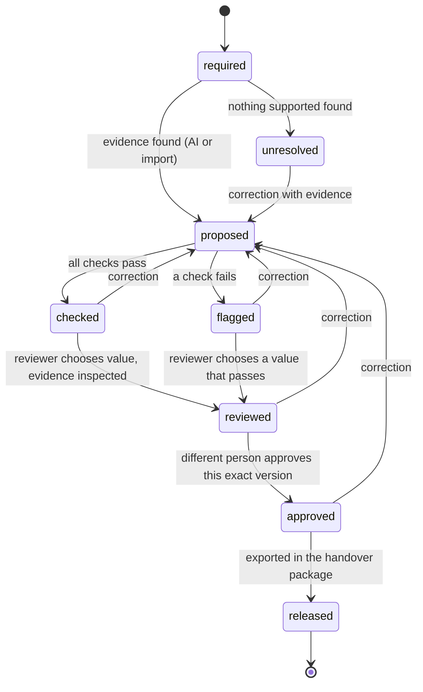
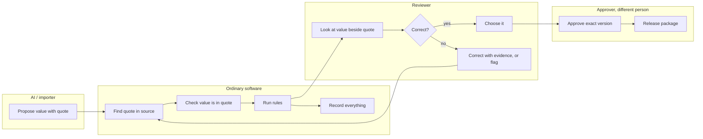

# Process model (v0.2)

## Life of one information element

```mermaid
stateDiagram-v2
    [*] --> required
    required --> proposed: evidence found (AI or import)
    required --> unresolved: nothing supported found
    proposed --> checked: all checks pass
    proposed --> flagged: a check fails
    checked --> reviewed: reviewer chooses value, evidence inspected
    flagged --> reviewed: reviewer chooses a value that passes
    reviewed --> approved: different person approves this exact version
    approved --> released: exported in the handover package
    checked --> proposed: correction
    flagged --> proposed: correction
    reviewed --> proposed: correction
    approved --> proposed: correction
    unresolved --> proposed: correction with evidence
    released --> [*]
```

## Who does what (lanes)

```mermaid
flowchart LR
    subgraph AI[AI / importer]
      a1[Propose value with quote]
    end
    subgraph SYS[Ordinary software]
      s1[Find quote in source] --> s2[Check value is in quote] --> s3[Run rules] --> s4[Record everything]
    end
    subgraph REV[Reviewer]
      r1[Look at value beside quote] --> r2{Correct?}
      r2 -- yes --> r3[Choose it]
      r2 -- no --> r4[Correct with evidence, or flag]
    end
    subgraph APR[Approver, different person]
      p1[Approve exact version] --> p2[Release package]
    end
    a1 --> s1
    s3 --> r1
    r3 --> p1
    r4 --> s1
```
